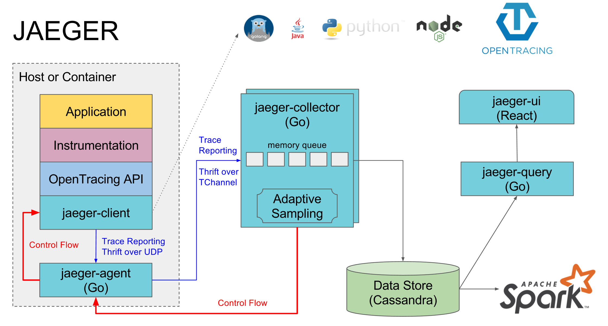

# 系统架构
## 概述
Jaeger的客户端坚决执行OpenTracing的标准模型，阅读[规范](https://github.com/opentracing/specification/blob/master/specification.md)可以使你更好的理解下面的内容

## 术语说明
### Span
**Span** 代表了系统当中具有操作名字的逻辑单元，具有操作的开始时间和持续时间。
A **Span** represents a logical unit of work in the system that has an operation name, the start time of the operation, and the duration. Spans may be nested and ordered to model causal relationships. An RPC call is an example of a span.

### Trace
A **Trace** is a data/execution path through the system, and can be thought of as a directed acyclic graph of spans

## 组件

This section details the constituents of Jaeger and how they relate to each other. It is arranged by the order in which spans from your application interact with them.

### Jaeger client libraries
Jaeger clients are language specific implementations of the [OpenTracing API](http://opentracing.io). They can be used to instrument applications for distributed tracing either manually or with a variety of existing open source frameworks, such as Flask, Dropwizard, gRPC, and many more, that are already integrated with OpenTracing.

An instrumented service creates spans when receiving new requests and attaches context information (trace id, span id, and baggage) to outgoing requests. Only ids and baggage are propagated with requests; all other information that compose a span like operation name, logs, etc. is not propagated. Instead sampled spans are transmitted out of process asynchronously, in the background, to Jaeger Agents.

The instrumentation has very little overhead, and is designed to be always enabled in production.

Note that while all traces are generated, only few are sampled. Sampling a trace marks the trace for further processing and storage.
By default, Jaeger client samples 0.1% of traces (1 in 1000), and has the ability to retrieve sampling strategies from the agent.

*Illustration of context propagation*

### Agent
为spans对外提供UDP网络端口服务，他可以批量的推送到collector。agent可以被当做所有主机的基础组件来部署。agent是从client中抽象出来的collector路由和发现的能力

### Collector
collector模块从Jaeger agents接收traces信息，并通过处理流程管道处理他们，当前的管道包括验证traces数据结构、建索引、数据格式转行，最后将他们落到存储服务里。存储服务是一个插件化的组件，当前支持Cassandra、ES

### Query
Query是一个为UI展示提供从存储和主机检索traces信息的服务
