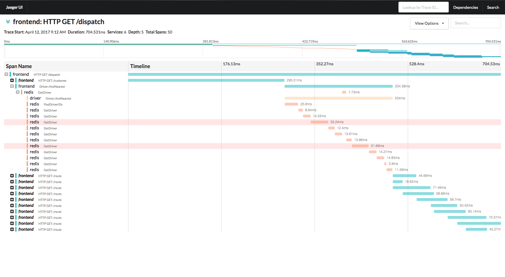

# Jaeger, 分布式跟踪系统
欢迎访问Jaeger的文档门户！Jaeger新手和有经验的老手都可以从下面获取到想要的内容

如果没有找到你想要的内容，或者有个其他问题，可以通过以下途径联系到我们
 [Github](https://github.com/jaegertracing/jaeger/issues), [Gitter chat](https://gitter.im/jaegertracing/Lobby), [mailing list](https://groups.google.com/forum/#!forum/jaeger-tracing).

## 关于
Jaeger受到了[Dapper][dapper] 和 [OpenZipkin](http://zipkin.io)的启发，由[Uber Technologies][ubeross]开发并开源的一个分布式跟踪系统

它可以用于监控微服务体系结构：

* 分布式上下文传播
* 分布式事务监控
* 根本原因分析
* 服务依赖关系分析
* 性能/延迟优化

通过这篇文章[Evolving Distributed Tracing at Uber](https://eng.uber.com/distributed-tracing/)可以了解到Jaeger的历史变迁和变化的原因

## 功能

  * [OpenTracing](http://opentracing.io/) compatible data model and instrumentation libraries
    * in [Go](https://github.com/jaegertracing/jaeger-client-go), [Java](https://github.com/jaegertracing/jaeger-client-java), [Node](https://github.com/jaegertracing/jaeger-client-node), [Python](https://github.com/jaegertracing/jaeger-client-python)
    and [C++](https://github.com/jaegertracing/cpp-client)
  * 在每个 服务/端 上使用一致的采样率
  * 抽样采样 (即将到来)
  * 收集数据的处理管道模型（即将到来）

## 技术选型

  * 后端组件实现采用了 Go 1.9
  * React/Javascript UI
  * [Cassandra 3.x](https://github.com/jaegertracing/jaeger/tree/master/plugin/storage/cassandra), [ElasticSearch](https://github.com/jaegertracing/jaeger/tree/master/plugin/storage/es) as persistent storage (more storage backends coming soon)

## 快速上手
 请看这篇[running a docker all in one image](getting_started.md#all-in-one-docker-image).

## 效果图

### Traces概览图

### Trace详情

## 更多相关文章链接
- [Evolving Distributed tracing At Uber Engineering](https://eng.uber.com/distributed-tracing/)
- [Tracing HTTP request latency in Go with OpenTracing](https://medium.com/opentracing/tracing-http-request-latency-in-go-with-opentracing-7cc1282a100a)
- [Distributed Tracing with Jaeger & Prometheus on Kubernetes](https://blog.openshift.com/openshift-commons-briefing-82-distributed-tracing-with-jaeger-prometheus-on-kubernetes/)
- [Using Jaeger with Istio](https://istio.io/docs/tasks/telemetry/distributed-tracing.html)
- [Using Jaeger with Envoy](https://envoyproxy.github.io/envoy/install/sandboxes/jaeger_tracing.html)

[dapper]: https://research.google.com/pubs/pub36356.html
[ubeross]: http://uber.github.io
